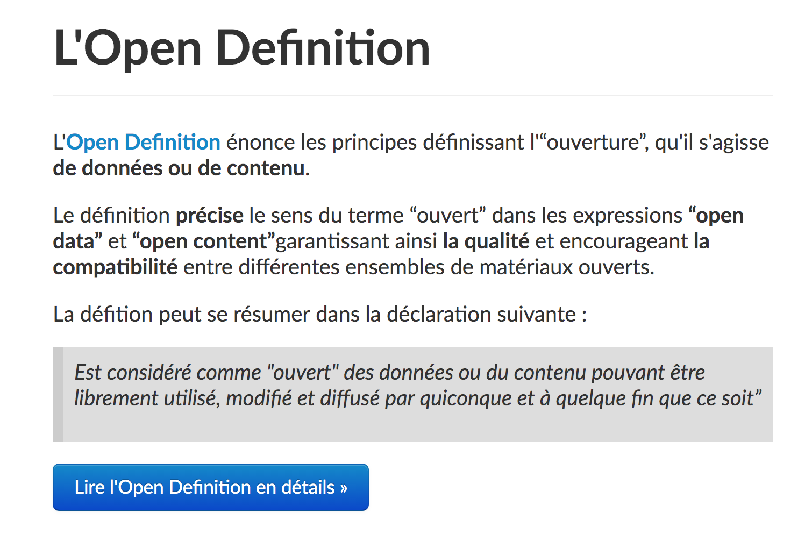
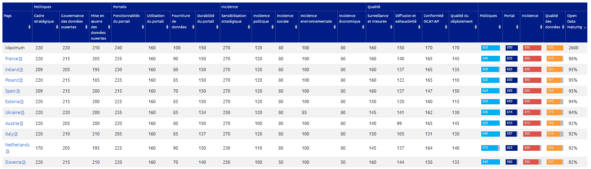
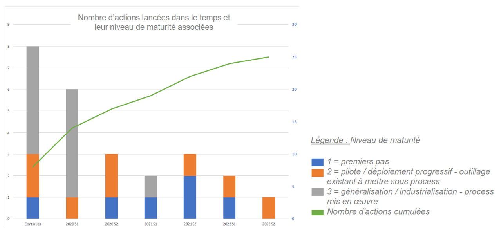

layout: true


`r paste0("<div class='my-footer'><span>", params$event, "</span> <center><div class=logo></center></span></div>")` 


---

class: center, middle

Ces slides en ligne : 

Sources : `r paste0("https://github.com/datactivist/", params$slug)`


Les productions de Datactivist sont librement réutilisables selon les termes de la licence [Creative Commons 4.0 BY-SA](https://creativecommons.org/licenses/by-sa/4.0/legalcode.fr).

<BR>
<BR>

.reduite[]

---
class: inverse, middle

Vous allez participer à la formation .red[Les fondamentaux de l’Open Data avant d’ouvrir les données sur data.economie.gouv.fr]

En guise d'introduction à la formation, voici quelques éléments sur l'histoire de l'open data afin que nous arrivions tous et toutes avec quelques éléments et un vocabulaire commun.

---

class: inverse, center, middle

# Introduction : data et open data

---

### .red[Une définition générale] des données 

.pull-left[]
 
.pull-right[
 
##### Les données sont couramment comprises comme les matériaux bruts produits dans l’abstraction du monde en catégories, mesures et toute autre forme de représentation-nombres, caractères, symboles, images, sons, ondes électromagnétiques, bits qui constituent les fondations sur lesquelles l’information et le savoir sont créés.

Cette définition est une des rares à s'extraire des discours entourant les données ou leurs infrastructures. L'auteur de cet ouvrage de référence en sociologie s'attache à définir précisément l'ontologie et l'épistémologie de la donnée.
]

---

### Une définition .red[des "bases de données"]

Source : [Source : Guide Open Data Cnil](https://www.cnil.fr/sites/default/files/atoms/files/guide_open_data.pdf) 

> On entend par base de données un recueil d'œuvres, de données ou d'autres éléments indépendants, disposés de manière systématique ou méthodique, et individuellement accessibles par des moyens électroniques ou par tout autre moyen (art L112-3 du code de la propriété intellectuelle)

> En d’autres termes il s’agit d’un ensemble de données organisé en vue de son utilisation par des programmes correspondant à des applications distinctes et de manière à faciliter l'évolution indépendante des données et des programmes (en anglais : data base)

Le document donne également une **définition de ce qu'est une "donnée"** :

> Une donnée correspond à la représentation d'une information sous une forme conventionnelle destinée à faciliter son traitement (en anglais : data).

---

### .red[La donnée], le plus petit élément d'information

.pull-left[
]

.pull-right[
- Les **.red[données]** sont la matière "brute" de l'information.
- **.red[L'information]** obtenue après interprétation des données.
- En créant des liens entre les informations, on obtient de la **.red[connaissance]**
- Donner du sens aux connaissances permet de se déclarer **.red[compétent]**.
] 

---
### .red[Open data] : un terme récent

Le terme est apparu pour la première fois dans les années 1970 dans les accords qu’a signés la NASA avec des pays partenaires en vue du partage de données satellitaires. 

C’est en 1995 qu’on en voit le premier usage public aux Etats-Unis dans un rapport de la National Academy of Science intitutlé "_On the Full and Open Exchange of Scientific Data_". Dans le langage courant, cela fait .red[**près de 10 ans**] que l'ouverture des données est devenue un élément majeur des politiques publiques numériques. 

---

### Open data, .red[les débuts] : 

Au début des années 2010, c’est dans le cadre d’un .red[mouvement international] que l’ouverture des données publiques connaît en France un nouvel élan. L’initiative vient du monde anglo-saxon, **les États-Unis et le Royaume-Uni mettant en place au même moment des plateformes gouvernementales de partage des données
publiques, dans une démarche dite d’open data**. 

Les objectifs de ce mouvement d’ouverture des données publiques sont à la fois

* .red[citoyens] : une plus grande transparence de l’action publique garantit un meilleur contrôle démocratique
* .red[économiques] : les données de l’administration peuvent être le support de nombreuses activités économiques et devraient être diffusées aussi largement que possible. 

Le contexte est alors marqué par l’essor considérable des technologies et de l’économique numérique.

---
class: inverse, center, middle

# 1. L'histoire de l'Open Data dans le monde

---

### Frise chronologique de l'évolution du .red[cadre législatif] français

```{r echo=FALSE}
library(timevis)
data <- data.frame(
  id      = 1:5,
  content = c("Open Definition", "La rencontre de Sebastopol", "L'appel de Tim Berne-Lee", "Charte du G8", "Charte Internationale"),
  start   = c("2005-11-10", "2007-10-22", "2009-02-04", "2013-06-18", "2015-05-29")
)
timevis(data, loadDependencies = FALSE, width = "715px", height = "350px")
```

---

### 2005 : [L'Open Definition](https://opendefinition.org/)

#### Une définition juridique des droits de l'usager d'un savoir ouvert

.reduite[.center[]]


---
### 2007 : [la rencontre de Sebastopol aux États-Unis](https://opengovdata.org/)


**Quoi ?** Une rencontre de l'Open Governement Group à Sebastopol (Californie), le siège des éditions O'Reilly

**Pourquoi ?** : Influencer le futur président des Etats Unis pour faire avancer l'open data

**Comment ?** En adoptant une déclaration définissant les grands principes de l'Open Government Data 

> Ces principes sont fondamentaux dans le futur développement de politiques nationales d’ouverture des données. Ils sont issus de la culture du mouvement du Libre dont les protagonistes sont à l'origine de cette rencontre et réflexion. 

.center[]


---

### 2009 : Tim Berners-Lee ["Des données brutes maintenant !"](https://www.ted.com/talks/tim_berners_lee_on_the_next_web?language=fr)
#### La demande de données brutes sous les projecteurs

.center[.reduite[]]

---

### 2013 : la [charte du G8 sur l'open data](https://www.modernisation.gouv.fr/sites/default/files/fichiers-attaches/charte-g8-ouverture-donnees-publiques-fr.pdf)

.center[]

---
### 2015 : la [charte internationale de l'open data](https://opendatacharter.net/)

.center[.reduite[]]

---

### Depuis 2010 : .red[l'ère des classements]

La France a très vite cherché à s’inscrire dans la dynamique de l'open data, non sans succès en termes de reconnaissance internationale : 

** [L'Open Data Maturity Report](https://data.europa.eu/fr/impact-studies/open-data-maturity) de la Commission Européenne a placé en 2021 la France à la première place devant l'Irlande et l'Espagne.**


La France est également classée 4e dans l’[Open Data Index](https://index.okfn.org/place/) établi par l’Open Knowledge Foundation et elle a obtenu une note de 85,13 sur 100 en 2016 au [baromètre international de l'Open Data](https://index.okfn.org/place/).

---
class: inverse, center, middle

# 2. Le déploiement de l'Open Data en France

---

### .red[Du droit d'accès] au droit de réutilisation des données publiques en France

Trois grandes étapes caractérisent en France la **construction d’un droit de l’ouverture des données publiques** : 

* 1 - La création du droit d’accès aux documents administratifs

* 2 - La création du droit de réutilisation des informations publiques

* 3 - Le développement d’une politique active d’ouverture des données, assorti d’un essor de la gratuité. 


---
### Un appareil législatif .red[étoffé]


1. **Loi CADA**, dite Loi Informatique et Libertés du 6 janvier 1978.

1. **Création de la CADA** (Commission d'Accès aux Documents Administratifs)

1. **Création de la CNIL** (Commission Nationale Informatique et Libertés)

1. **Directive INSPIRE** de 2007

1. **Directive PSI** de 2013

1. **Loi Valter** de 2015

1. **Loi pour une République Numérique** (loi Lemaire) du 7 octobre 2016.

---

### Frise chronologique de l'évolution du .red[cadre législatif] français

```{r echo=FALSE}
library(timevis)
data <- data.frame(
  id      = 1:7,
  content = c("Loi CADA","Directive PSI", "Directive INSPIRE", "Révision de la directive PSI", "Loi Notre", "Loi Valter", "Loi pour une République Numérique"),
  start   = c("1978-07-17","2003-11-17", "2007-03-14","2013-06-13","2015-08-07","2015-12-28","2016-10-07")
)
timevis(data, loadDependencies = FALSE, width = "715px", height = "350px")
```

---

### .red[1789] L'article 15 de la Déclaration des Droits de l'Homme et du Citoyen

La première brique du droit d'accès aux documents administratifs est posée dès la Déclaration des Droits de l'Homme est du Citoyen avec l'article 15.Il s'agit de .red[réduire les asymétries d'information] en accédant au matériau brut de l'information et du savoir

.reduite[.center[]]

---

### .red[1978] : La loi CADA, vers le "droit de savoir"
* Le fondement : la .red[Déclaration des Droits de l'Homme et du Citoyen de 1789] dans son article 15, "la Société a le droit de demander compte à tout Agent public de son administration." 

* Le droit d'accès des citoyens à l'information publique émerge en **1978 avec la loi dite CADA** du nom de la Commission d'Accès aux Documents Administratifs. 

* La France était le .red[3e pays au monde] après la Suède en 1766 et les Etats-Unis en 1966 avec le Freedom of Information Act (FOIA) en 1966  à accorder un "droit de savoir" avec pour but d'améliorer les relations entre le public et l'administration.

.footnote[Il faudrait maintenant désigner la loi comme le Code des relations entre le public et l'administration (CRPA) qui, dans son [livre 3](https://www.legifrance.gouv.fr/affichCode.do;jsessionid=BDF8EC0BD562E214CCD9A5ADD435D690.tplgfr42s_1?idSectionTA=LEGISCTA000031367685&cidTexte=LEGITEXT000031366350&dateTexte=20190429), codifie le droit d'accès et de réutilisation mais il est encore moins connu que la loi CADA…]

---
### Un droit d'accès très faible au regard des standards internationaux

.pull-left[Paradoxe : la France a une législation parmi les plus ambitieuses au monde en matière d'open data mais le droit d'accès y est un des plus mauvais au monde… 

La France est classée .red[110e sur 134] du classement mondial des lois d'accès à l'information publique RTI Rating.

L'open data est comme la Tour de Pise : un très bel édifice posé sur des fondations instables.
]

.pull-right[
[](https://www.rti-rating.org/country-data/)
]
---

### La création du .red[droit de réutilisation des informations publiques] avec la Directive ISP/PSI

* Partant du constat que le secteur public produit et diffuse un grand nombre d’informations et qu'elles « constituent une matière première importante pour les produits et services de contenu numérique », la directive PSI de 2003 concernant la réutilisation des informations du secteur public se fonde sur des considérations économiques. .red[**Elle introduit la notion de réutilisation commerciale et non-commerciale.**]

> En France, elle est transposée par l'ordonnance du 6 juin 2005, qui insère dans la loi CADA de 1978 un nouveau chapitre relatif à la réutilisation des informations publiques.

---

### Le .red[droit de réutilisation des informations publiques] 

Le droit de réutilisation issu de la directive PSI *se combine donc en France avec le droit d’accès aux documents administratifs* reconnu depuis 1978 : les informations contenues dans tout document administratif communicable sont, en principe, réutilisables « _par toute personne qui le souhaite à d'autres fins que celles de la mission de service public pour les besoins de laquelle les documents ont été élaborés ou sont détenus_ ». 

> Par cette combinaison, le droit français garantit ainsi une liberté effective de réutilisation bien plus grande que celle imposée par la directive ISP. Le principal apport de la transposition au droit français est d’avoir mis fin à l’interdiction de réutilisation des documents administratifs à des fins commerciales.

---

### .red[La loi pour une République Numérique] : une obligation de diffusion et un accès actif aux données

* **La loi est promulguée le .red[7 octobre 2016]**

Elle a pour objectifs de : 
* Encourager l’innovation et l’économie numérique
* Promouvoir une société numérique protectrice 
* Garantir l’accès de tous au numérique (Haut débit..)

Source : 
http://www.vie-publique.fr/actualite/dossier/loi-internet/republique-numerique-que-change-loi-du-7-octobre-2016.html

---

### .red[L'ouverture des données par défaut], un premier principe fondamental de la Loi Lemaire

> Les administrations devront publier en ligne dans un standard ouvert leurs principaux documents, y compris leurs codes sources, ainsi que leurs bases de données qui présentent un intérêt économique, social, sanitaire ou environnemental. 


Cette obligation concerne toutes les *administrations*, établissements publics, collectivités et organismes privés chargés d’un service public, à deux conditions : compter au moins **50 agents** et **3500 habitants**.

---
### .red[Le périmètre] de l'open data par défaut 

L'ouverture concerne un .red[**périmètre très large**] : 
* les documents communiqués suite à des demandes CADA

* les "bases de données"

* les données "dont la publication présente un intérêt économique, social, sanitaire ou environnemental".


> Rares sont donc les données publiques qui ne sont pas concernées par cette obligation d'ouverture. 

---

### .red[Création d’un] service public de la donnée

→ La loi souhaite faciliter la réutilisation des principales bases de données de l’État par les acteurs privés ou publics (entreprises, associations, chercheurs, etc.), en leur garantissant un niveau élevé de qualité de service.

→ La loi propose de mettre à disposition comme “service public” les grandes bases de données de référence de l’État , comme par exemple le répertoire SIRENE des entreprises ou le cadastre. 

---

### Les 9 jeux de données du .red[Service Public de la Donnée]

* Le répertoire des entreprises et des établissements (base Sirene)
* Le répertoire national des associations (RNA),
* Le plan cadastral informatisé (« Cadastre »),
* Le registre parcellaire graphique (RPG)
* Le référentiel à grande échelle (RGE),
* La base adresse nationale (BAN),
* Le répertoire opérationnel des métiers et des emplois (ROME),
* Le référentiel de l’organisation administrative de l’Etat,
* Le code officiel géographique (COG).

Source : https://www.data.gouv.fr/en/reference

---

### .red[La LRN encourage]  l'utilisation de standards ouverts


Afin de faciliter la réutilisation des données par les machines, la loi pour une République Numérique consacre **l'utilisation de standards ouverts** pour la communication des documents administratifs. 

L’administration est dorénavant tenue, lorsqu’elle communique un document administratif au format électronique, de le mettre à disposition du citoyen **"dans un standard ouvert, aisément réutilisable et exploitable par un système de traitement automatisé"**. 

Concrètement, cela devrait empêcher la publication de fichiers PDF là où un fichier CSV pourrait être diffusé.

---

### Ainsi qu'une .red[limitation des licences]

La loi **limite par décret les licences** qui peuvent être utilisées par les administrations. Le [décret du 27 avril 2017](https://www.legifrance.gouv.fr/eli/decret/2017/4/27/2017-638/jo/texte) autorise deux licences : 

* la Licence Ouverte d'Etalab 

* la licence ODbL (Open Database License).

Ces deux licences offrent **un choix aux administrations** : la licence ouverte étant plus permissive que la licence ODBL qui a été conçue dans une logique de "pot commun" permettant de garantir que les données resteront ouvertes après leur réutilisation.

Utiliser une autre licence impose une **homologation** auprès de la DINSIC avec un exposé des motifs ayant conduit à sortir de la liste fixée dans le décret et une consultation des usagers affectés par la licence proposée. L'homologation doit être faite pour chaque jeu de données même si la licence reste la même.

---

### .red[Les conditions d'exercice] du droit d'accès aux documents administratifs

Une définition .red[très large] des documents administratifs
> Les documents administratifs peuvent revêtir de nombreuses formes (dossiers, rapports, études, comptes rendus, procès-verbaux, statistiques, directives, instructions, circulaires, codes sources, etc.) et adopter tout support (écrit, enregistrement sonore ou visuel, forme numérique ou informatique). 

Le droit d'accès s'applique dans le cadre d'une .red[mission de service public] ie :
> Une mission d'intérêt général sous le contrôle de l'administration et qui est dotée à cette fin de prérogatives de puissance publique est chargée de l'exécution d'un service public. 

Il ne s’exerce que si l’administration a effectivement en sa possession le document demandé, que si le document est formellement **achevé**, qu'il existe et qu'il n'est pas **préparatoire à une décision administrative** en cours. 

---
### .red[Les exclusions] au droit d'accès

Le droit d'accès .red[**ne doit pas porter atteinte aux secrets protégés**] : 
- le fonctionnement de l'État : délibérations du Gouvernement, secret de la défense nationale, la conduite de la politique extérieure de la France, la sûreté de l'État…
- la protection de la vie privée
- le secret médical
- le secret des affaires (secret des procédés, des informations économiques et financières et
des stratégies commerciales ou industrielle)
- les mentions portant une appréciation ou un jugement de valeur sur une personne physique ou
faisant apparaître un comportement d'une personne pouvant lui porter préjudice…

Le document ne peut être publié qu'après avoir fait l'objet d'un traitement permettant
d'.red[**occulter les mentions protégées**]. L’administration n’est pas tenue de publier un document lorsque “les travaux d’occultation dénatureraient ou videraient de sens le document” ou si “le document est indivisible ou l’occultation est trop complexe”.

---
### Le cas des .red[données personnelles]

La prohibition de la communication à des tiers ne porte pas sur les données personnelles en général, mais .red[**sur les données à caractère personnel relevant de la vie privée**] des personnes concernées (âge, coordonnées personnelles, situation patrimoniale et financière, sympathies politiques, les croyances religieuses…)

La mise en ligne de données à caractère personnel sans anonymisation n'est permise que dans .red[**trois cas**] :
1. une disposition législative contraire le prévoit (exemple : [Transparence Santé](https://www.data.gouv.fr/fr/datasets/transparence-sante-1/))
2. si les personnes intéressées ont donné leur accord (consentement au sens de l’article 4 du RGPD)
3. les documents relevant de [l’article D312-3-1 du CRPA](https://www.legifrance.gouv.fr/affichTexte.do;jsessionid=51E99AF738C12521572D6A7F6C8C03E8.tplgfr23s_1?cidTexte=JORFTEXT000037797147&dateTexte=&oldAction=rechJO&categorieLien=id&idJO=JORFCONT000037796937)


Hors de ces cas, il faut .red[**[anonymiser les données](https://github.com/SGMAP-AGD/anonymisation/wiki/Guide-de-l'anonymisation)**] : elles ne doivent plus se référer à une personne réelle (exit les noms, identifiants…) et ne doivent plus être spécifiques à un individu mais communes à un ensemble de personnes. L’indexation de ces données par un moteur de recherche externe est proscrite.

---
### L'ouverture des .red[données d'intérêt général]

La loi définit comme .red[DIG] "les données de nature privée mais dont la publication peut se justifier en raison de leur intérêt pour améliorer les politiques publiques".

Sont notamment concernées :
* les données issues de délégation de service public
* les données essentielles des conventions de subvention
* les données de la statistique publique : certaines bases de données des entreprises pour les enquêtes de l'INSEE
* les données de la recherche

---
### La .red[circulaire du 27 Avril 2021]

Elle fait suite au rapport du député Eric Bothorel sur la politique publique de la donnée remis au premier ministre Jean Castex en Décembre 2020.

Véritable coup d'accélérateur :
* Elle rappelle le cadre juridique favorable à l'ouverture des données
* Elle demande aux différents ministère de nommer un administration ministériel des données
* Elle fait de l'ouverture des données un objectif pour les directeurs d'administration centrale et services déconcentrés.
* Elle demande la nomination d'un référent données, algorithmes et codes sources auprès des préfets de région.

---
### Une .red[feuille de route] de publication des jeux de données et des codes sources

Le Ministèrede la Transformation Publique publie une feuille de route avec les jeux de données et les codes sources qui seront publiés. La date de publication prévue y est indiquée.

L'ouverture des données et codes source peut être suivie sur [ouverture.data.gouv.fr](https://ouverture.data.gouv.fr/)
On peut y voir que le MEFR respecte ses engagements.

---
### L'état des lieu de .red[l'ouverture des données du MEFR]

* Le MEFR est le premier ministère à lancer sa feuille de route data avec un déploiement dès 2020.
* La feuille de route comprend 25 actions planifiées entre 2020 et 2022 (dont 8 se dérouleront en continue).



---
### Le .red[BercyHub] à l'animation de la politique open data du MEFR 

* enrichissement et valorisation des données via la plateforme [data.economie.gouv.fr](https://data.economie.gouv.fr/)
* pilotage du réseau des correspondants open data
* événements d'acculturation
* identification de nouvelles données d'intérêt

---

class: inverse, middle

# .red[Le programme] de votre formation

Retrouvons-nous pour un temps de formation pratique sur **Les fondamentaux de l’Open Data avant d’ouvrir les données sur data.economie.gouv.fr**

* Les enjeux de l'ouverture des données publiques 
* Imaginer l'usage des données avec data.economie.gouv.fr
* Evaluer la mise en qualité des données
* Comprendre les formats
* L'anonymisation
---

class: inverse, center, middle

# Merci !

Pour me contacter :
[julia@datactivist.coop](mailto:julia@datactivist.coop)
